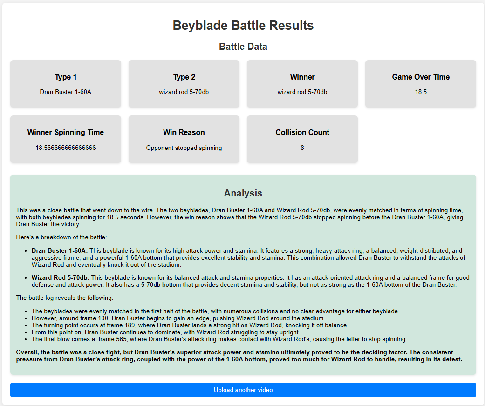

# Beyblade Battle Analysis System



## Overview
The Beyblade Battle Analysis System is designed to analyze and interpret Beyblade battles using advanced computer vision techniques. This system captures video of battles, detects and the Beyblades, and provides detailed insights through a user-friendly dashboard.

## Repository Link

https://github.com/sayyidan-i/Beyblade-Analytics-Flask

## Tech Stack
- **Flask**: A lightweight web framework used to build the dashboard and handle video uploads and user interactions.
- **OpenCV**: Used for image processing and video analysis.
- **YOLOv10**: A state-of-the-art object detection model utilized to detect and track Beyblades in the video.
- **Gemini**: An advanced generative AI model used to analyze battle logs and provide insights based on the results.
- **Roboflow**: A tool used for manual labeling of training data.

## Model Selection
The Beyblade detection model chosen for this project is the YOLOv10 (You Only Look Once version 10) model. This model was selected due to its real-time object detection capabilities, high accuracy, and efficiency in processing video frames. 

The training data for this model was sourced from YouTube videos of Beyblade battles, where key frames were extracted and manually labeled using Roboflow.

Youtube Video Link: https://www.youtube.com/watch?v=QdhF3GMv778

Roboflow Dataset Link: https://universe.roboflow.com/test-ioja3/beyblade-battle-detection/dataset/2

## Model Performance
The performance of the Beyblade detection model is as follows:
- **Precision**: 97.88%
- **Recall**: 94.04%
- **mAP50**: 98.15%
- **mAP50-95**: 84.12%
- **Fitness**: 85.53%

These metrics indicate that the model performs exceptionally well in detecting and recognizing Beyblades in various battle conditions.

## Installation

1. Clone the repository:
    ```bash
    git clone https://github.com/sayyidan-i/Beyblade-Analytics-Flask
    cd Beyblade-Analytics-Flask
    ```

2. Install the required packages:
    ```bash
    pip install -r requirements.txt
    ```

## Usage

1. Prepare the video file of the Beyblade battle. You can get the video from [Google Drive](https://drive.google.com/drive/u/0/folders/1wPYHPnmfzEyI0PhxG3FEaFBaW3B34F7R).

2. Run the Flask app:
    ```bash
    python app.py
    ```
3. Open the browser and go to `http://http://127.0.0.1:5000/`
4. Upload the video file and wait for the analysis to complete.

## Features and Logic

1. **Beyblade Detection**: The system employs the YOLOv10n model to identify different types of Beyblades and utilizes the BotSORT algorithm to assign unique IDs for tracking. This allows the system to distinguish between two Beyblades, even if they are of the same type, preventing any confusion during battles.

2. **Collision Detection**: The system measures the distance between the centers of detected Beyblades. A collision is detected if the distance between the centers of their bounding boxes is less than the threshold. The collision_active flag resets to False when the distance exceeds this threshold. Tracking the collision count is crucial for analyzing battle dynamics and evaluating Beyblade performance.
  
3. **Stop Detection**: The program utilizes optical flow techniques to monitor the movement of the Beyblades. Optical flow is a computer vision technique that estimates the motion of objects between consecutive frames in a video by analyzing changes in pixel intensity. If the motion falls below a specified threshold for a set number of frames, the Beyblade is marked as "stopped" and the opponent is declared the winner.
  
4. **Out of Arena Detection**: The system tracks the number of frames a Beyblade goes undetected. If a Beyblade is missing for a certain duration, it is considered "out of the arena," and the opponent is declared the winner.

5. **Game Over Time** : The system calculates the time taken for the game to end. The game ends when one of the Beyblades is declared the winner due to a stop or out-of-arena event.

6. **Winner Spinning Time**: The system calculates the total spinning time of the winning Beyblade during the battle until it stopped or the video ended.

7. **Battle Analysis**: The battle logs, which contain frame-by-frame data on the positions and statuses of the Beyblades, are analyzed using Gemini. This analysis provides a detailed report on the battle, including insights on the performance of each Beyblade and the overall outcome.
